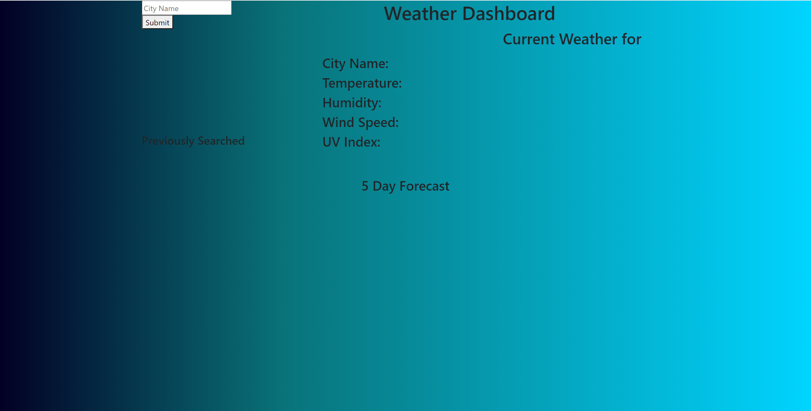

# Weather-Dashboard

For this assignment, I built a dashboard that provides a search bar, and upon input of a city name the relevant indexes are pulled up for the current date, with data provided from OpenWeather API calls. It was supposed to have the 5 day forecast, and I have found the data within the array to pull it up, but was not able to get it to propagate to the page.

